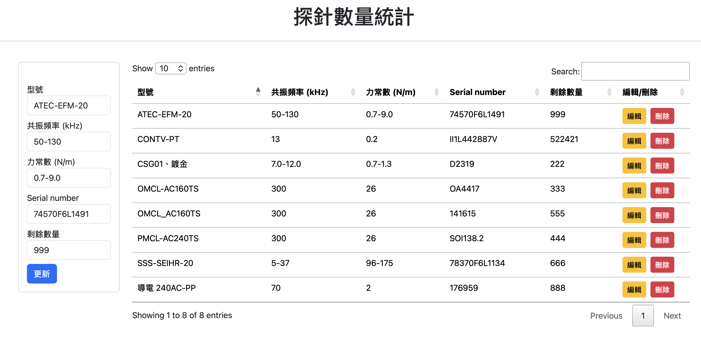

# AFM 探針庫存管理系統

## 🎯 專案背景

### 解決的問題
AFM 探針在實驗室管理中面臨諸多挑戰：
- ⚠️ **單價高昂**：每支探針價格不菲，需精確追蹤使用情況
- 📉 **消耗品特性**：實驗過程中持續消耗，難以掌握實際庫存
- 🔢 **型號繁多**：不同實驗需求對應不同規格（共振頻率、力常數等），容易混淆
- ⏰ **人工盤點困難**：傳統人工清點耗時且容易出錯
- 🚨 **缺貨風險**：無法即時掌握庫存，影響實驗進度

### 系統優勢
本系統讓實驗人員可以**實驗完畢後立即記錄使用情況**，管理者能**即時掌握庫存狀態**，在探針不足時**及時採購**，完全取代人工定期清點作業，確保實驗室運作流暢。

## 🚀 功能特色

- ✅ **即時記錄使用**：實驗完成後隨時記錄探針使用數量
- 📊 **型號規格管理**：記錄型號、共振頻率、力常數、序號等完整資訊
- 🔍 **快速搜尋排序**：輕鬆查找特定型號或規格的探針
- 📱 **跨裝置使用**：電腦、平板、手機都可操作
- 💾 **雲端自動備份**：資料儲存在 Google Sheets，不怕資料遺失
- 👥 **多人協作**：實驗室成員可同時使用，即時同步

## 📸 系統介面



系統採用簡潔直觀的設計，左側為資料輸入表單，右側為探針庫存列表。表格支援即時搜尋、排序和分頁功能，讓實驗人員能快速找到所需探針資訊。每筆記錄都配有「編輯」和「刪除」按鈕，方便在實驗完成後立即更新庫存數量，真正實現「用完即記錄」的便捷管理流程。

## 📦 快速開始

### 1. 建立 Google Sheets

1. 建立新的 Google Sheets 試算表
2. 將工作表命名為 `data`
3. 在第一列建立以下欄位：`id` | `type` | `freq` | `force` | `number` | `qty`

### 2. 設定 Apps Script

1. 在 Google Sheets 中，點選 **擴充功能** → **Apps Script**
2. 上傳專案中的所有檔案：
   - `Code.js` → 重新命名為 `Code.gs`
   - `index.html`
   - `js.html`
   - `appsscript.json`

### 3. 部署

1. 點選 **部署** → **新增部署作業**
2. 類型選擇：**網頁應用程式**
3. 執行身分：**我**
4. 存取權限：**組織內的任何人**（建議）
5. 點選 **部署** 並複製網頁 URL

### 4. 開始使用

開啟部署後的 URL，即可開始管理探針庫存！

## 📖 使用方式

### 新增探針（收到新貨時）
在左側表單填入探針資訊後點擊「新增」：
- **型號**：探針型號（如 AC240TS）
- **共振頻率 (kHz)**：如 70
- **力常數 (N/m)**：如 2
- **Serial number**：探針序號
- **剩餘數量**：初始數量

### 更新庫存（實驗使用後）
1. 點擊該探針的「編輯」按鈕
2. 更新「剩餘數量」欄位
3. 點擊「更新」

### 刪除記錄
點擊「刪除」按鈕即可移除該筆記錄

### 搜尋與排序
- 使用右上角搜尋框快速查找探針
- 點擊欄位標題進行排序

## 📁 檔案說明

```
AFM-Probe-Inventory-Statistics/
├── appsscript.json    # 專案設定檔（時區、權限等）
├── Code.js            # 後端邏輯（資料增刪改查）
├── index.html         # 前端介面（表單與表格）
└── js.html            # 前端 JavaScript（互動邏輯）
```

## 🔧 技術架構

**前端**：HTML5 + Bootstrap 5 + jQuery + DataTables  
**後端**：Google Apps Script  
**資料庫**：Google Sheets

**資料流程**：使用者操作 → JavaScript → Apps Script → Google Sheets → 回傳結果 → 更新畫面

## 📊 資料欄位

| 欄位 | 說明 | 範例 |
|------|------|------|
| id | 系統自動產生的唯一識別碼 | `aB3xY9z` |
| 型號 | 探針型號 | `AC240TS` |
| 共振頻率 (kHz) | 探針共振頻率 | `70` |
| 力常數 (N/m) | 探針力常數 | `2` |
| Serial number | 探針序號 | `SN-2024-001` |
| 剩餘數量 | 目前庫存數量 | `15` |

## 💡 使用建議

### 日常操作
- 實驗結束後立即更新使用數量，避免遺忘
- 定期檢視庫存，提前採購即將用完的探針
- 記錄詳細的 Serial number，便於追蹤問題探針

### 庫存管理
- 建議設定安全庫存量（如 5 支），低於此數量即採購
- 可在 Google Sheets 中使用條件式格式設定，庫存不足時自動標紅色提醒 (進行中...)

### 擴充建議
- **低庫存通知**：自動發送 Email 提醒採購
- **使用統計**：分析各型號使用頻率，優化採購策略
- **匯出報表**：產生月度或季度使用報表
- **批次匯入**：新進探針時可批次匯入資料

## 🔒 安全性

- 建議設定為「組織內的任何人」可存取，避免外部人員查看
- 定期備份 Google Sheets（每月下載一次）
- 使用 Google Sheets 版本記錄功能追蹤變更歷史

---

## 👤 作者

**開發者**：Backy-JP  
**Email**：jiapei311157@gmail.com  
**GitHub**：[@Backy-JP](https://github.com/Backy-JP)  

本系統專為解決實驗室 AFM 探針庫存管理需求而設計。

**版本**：1.0.0  
**最後更新**：2026-02-26  
**授權**：供實驗室內部使用  
**技術支援**：如遇問題請檢查 Google Sheets 設定和 Apps Script 授權
